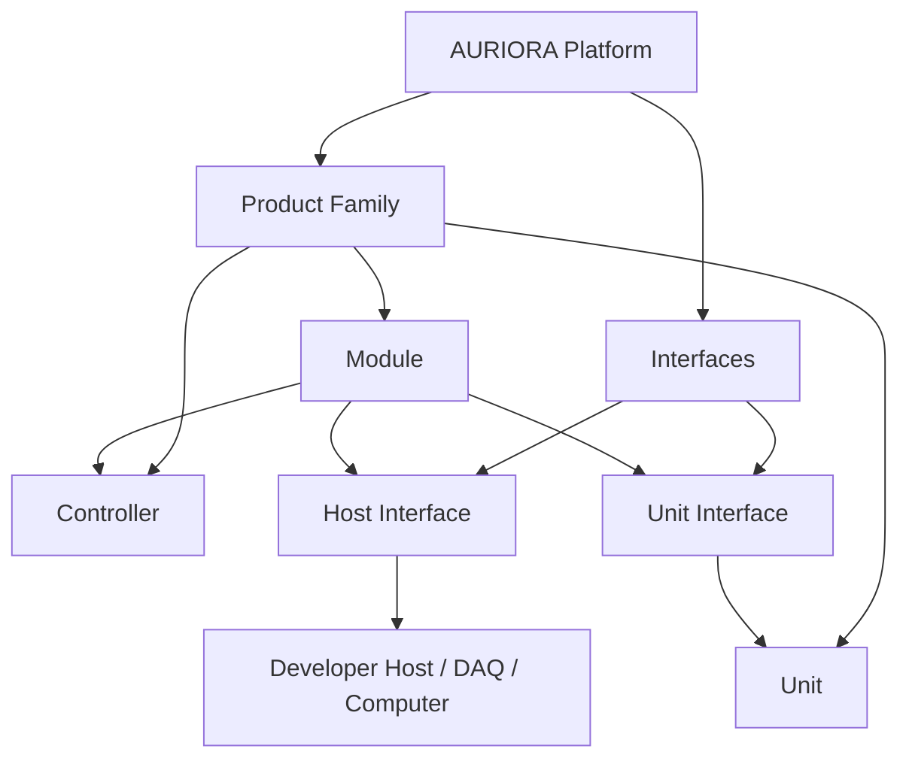
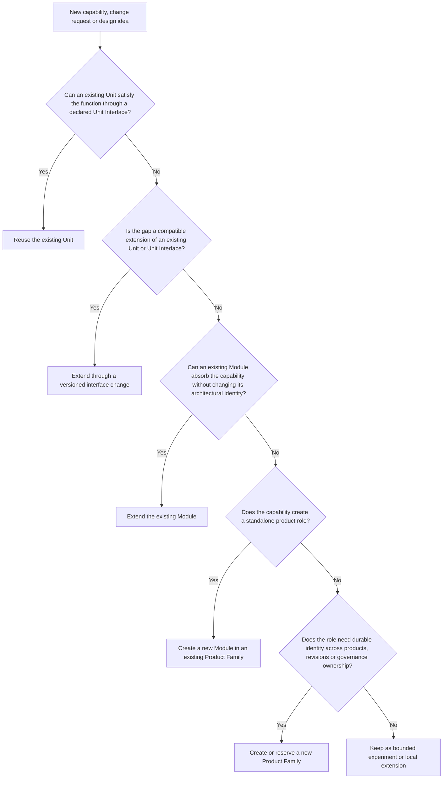

# AURIORA Engineering Standard

**Document ID:** AES-INDEX
**Version:** 1.0.0
**Status:** Normative
**Language:** English

## 1. Scope

The AURIORA Engineering Standard (AES) is the constitutional engineering document of the AURIORA Platform. It defines:

- the AURIORA architectural vocabulary: Platform, Product Family, Module, Controller, Unit, Host Interface, Unit Interface
- naming and identity principles
- interface ownership and compatibility principles
- the maturity model and what each maturity level requires
- open engineering and publication principles
- when a decision needs a formal record

AES defines *what* must be true about AURIORA engineering work. The companion guides define *how* work is done in their domain. Where a companion and AES conflict, AES prevails.

AES is written for a small team — currently one or two developers — that intends to grow. It deliberately requires only the process that pays for itself: enough documentation to understand, continue, test and reproduce the work, and never documentation whose maintenance costs more than the risk it reduces.

## 2. Requirement Language

AES and its companion guides use three requirement levels:

- **MUST / SHALL** — mandatory *when applicable*. Most MUSTs apply only to certain artifact types or maturity levels; each states its scope.
- **SHOULD** — the recommended default. Engineering judgment may justify another approach; skipping a SHOULD does **not** require a documented or reviewed exception.
- **MAY** — optional.

Deviating from an applicable MUST requires a note. During Experimental and Active Development work, a concise note in the project's normal design documentation (README, `docs/design-notes.md`, an issue or a schematic annotation) is sufficient. A formal exception record is required only for Released artifacts and for platform-wide deviations with real compatibility or safety consequences (see [Decisions and Governance](./docs/08-decisions-and-governance.md)).

Silent deviation from an applicable MUST is non-conformant. Honest, noted deviation is normal engineering.

## 3. Maturity Model

Every AURIORA artifact has exactly one maturity level, stated in its README. The level — not the artifact type — determines how much documentation, review and release evidence is expected.

| Level | Meaning | Typical artifacts |
|---|---|---|
| **Experimental** | Built to learn. May be incomplete, rough or temporary — but its status is stated honestly. | Feasibility studies, test boards, breadboards, temporary firmware, internal tools, one-off experiments, early prototypes. |
| **Active Development** | Real AURIORA work expected to evolve into a public project. Documentation actively supports engineering. | Modules and applications under development, iterating hardware revisions, maintained firmware and software. |
| **Released** | A tagged, reproducible public engineering artifact with stable interfaces. | Tagged releases, manufacturable hardware, distributed firmware and software. |

End-of-life states: **Deprecated** (existing use supported, migration recommended, not for new designs) and **Retired** (archival only). Deprecation and retirement rules are in [Maturity and Release](./docs/07-maturity-and-release.md).

The per-level expectations — documentation minimums, review expectations and release requirements — are defined in [Maturity and Release](./docs/07-maturity-and-release.md). The short version:

- **Experimental:** source files, a short README (purpose, status, key pinouts/interfaces, known hazards), a license. Nothing else by default.
- **Active Development:** a useful README, editable sources, current interface information, a living `docs/design-notes.md` (or equivalent) for decisions, open questions and known issues, build/bring-up instructions and BOM where applicable, licensing.
- **Released:** reproducible sources and build information, versioned release, manufacturing outputs and final BOM where applicable, documented interfaces, essential test evidence, known limitations, safety and calibration information where applicable, licensing.

## 4. Conformance

An artifact conforms to AES when it:

1. states its maturity level honestly,
2. satisfies the MUST requirements applicable to its artifact type and maturity level,
3. notes any deviations from applicable MUSTs, and
4. uses the canonical vocabulary of [Terminology](./docs/02-terminology.md).

There are no conformance certificates, conformance statements or traceability matrices. Conformance is an engineering claim checked in ordinary review, not a paperwork product. Requirement blocks in AES chapters are the compliance-bearing text; explanatory prose, examples, diagrams and checklists guide interpretation but create no obligations.

## 5. Canonical Documents

| Document | Purpose |
|---|---|
| [01 Principles](./docs/01-principles.md) | The engineering posture: platform thinking, explicitness, honest documentation. |
| [02 Terminology](./docs/02-terminology.md) | Canonical AURIORA vocabulary. Frozen core terms. |
| [03 Architecture](./docs/03-architecture.md) | Platform structure; Module, Controller and Unit design rules. |
| [04 Naming and Identity](./docs/04-naming-and-identity.md) | Family identifiers, product numbers, revisions, serials, AOIDs, document IDs. |
| [05 Interfaces and Versioning](./docs/05-interfaces-and-versioning.md) | Interface contracts, compatibility, versioning and evolution. |
| [06 EEPROM Metadata](./docs/06-eeprom-metadata.md) | Electronic identity contract for replaceable Units. |
| [07 Maturity and Release](./docs/07-maturity-and-release.md) | Maturity levels in detail; documentation minimums; release, manufacturing, testing, calibration and open hardware requirements. |
| [08 Decisions and Governance](./docs/08-decisions-and-governance.md) | Fixed historical decisions; when ADRs/EDRs are needed; small-team governance. |
| [09 Review Checklists](./docs/09-review-checklists.md) | One general engineering checklist and a release checklist. |
| [Document Index](./docs/document-index.md) | Index of AES documents, companion documents and retired document/requirement IDs. |
| [Worked Example](./examples/worked-example-module-lifecycle.md) | One hypothetical Module from breadboard to release across the maturity levels. |

Companion standards and guides, each in its own repository:

| Document ID | Companion Document | Domain |
|---|---|---|
| `AHDG` | [AURIORA Hardware Design Guide](https://github.com/auriora-org/auriora-hardware-design-guide) | Hardware design |
| `AFSG` | [AURIORA Firmware Style Guide](https://github.com/auriora-org/auriora-firmware-style-guide) | Embedded firmware |
| `ASSG` | [AURIORA Software Style Guide](https://github.com/auriora-org/auriora-software-style-guide) | Host-side software |
| `ADS` | [AURIORA Documentation Standard](https://github.com/auriora-org/auriora-documentation-standard) | Documentation |

## 6. Primary Architecture Reference

This diagram shows containment and governance relationships, not PCB placement or firmware call structure.

## 7. Primary Architectural Decision Tree

When a new capability or design idea appears, walk this reuse order before creating new architecture:

For Experimental work, walking this tree mentally and noting the outcome in the README or design notes is enough. A formal record is needed only for the decisions listed in [Decisions and Governance](./docs/08-decisions-and-governance.md).

## 8. Normative Foundation

### AES-GOV-001: Markdown Source of Truth

**Requirement:** AES and AES-governed normative documents SHALL be authored as Markdown source files in version control. Rendered formats MAY be published but SHALL NOT override the Markdown source.

**Rationale:** Markdown keeps standards close to code review, diffing, release tags and long-term archival.

### AES-GOV-002: Platform-First Decisions

**Requirement:** Where a design decision affects Platform vocabulary, a declared interface, a Product Family identity or a published compatibility promise, long-term Platform consistency SHOULD be preferred over local optimization, and an intentional deviation SHALL be noted per Section 2.

**Rationale:** AURIORA is expected to evolve for decades; inconsistent shortcuts at Platform boundaries compound into compatibility failures. Purely local implementation choices are not governed by this rule.

### AES-GOV-003: Honest Deviations

**Requirement:** Any deviation from an applicable MUST/SHALL requirement SHALL be noted in the project's design documentation with a one-line reason. For Released artifacts and platform-wide deviations, the note SHALL additionally state scope, risk and — where temporary — the condition for removal.

**Rationale:** Exceptions are normal engineering; undocumented exceptions become accidental architecture. A note is cheap. A formal exception register is required only where the deviation outlives prototypes.

## 9. ADR and EDR Index

Architecture Decision Records (platform standard decisions):

- [ADR-001: Platform-First Modular Architecture](./docs/adr/ADR-001-platform-first-modular-architecture.md)
- [ADR-002: Stable Object Identifier Scheme](./docs/adr/ADR-002-stable-object-identifier-scheme.md)
- [ADR-003: EEPROM Metadata as Unit Identity Contract](./docs/adr/ADR-003-eeprom-metadata-contract.md)

Engineering Decision Records (platform-wide engineering decisions):

- [EDR-001: Controllers Are Separated from Modules](./docs/edr/EDR-001-controller-module-separation.md)
- [EDR-002: Unit Identity Is Electronic and Runtime-Discoverable](./docs/edr/EDR-002-runtime-unit-identity.md)
